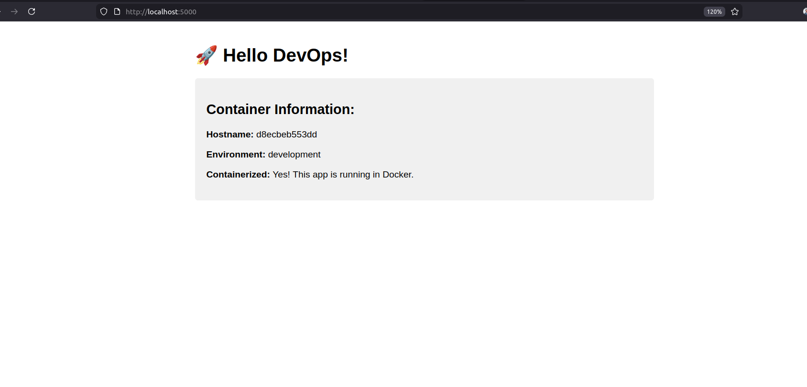

# Flask DevOps Project

A simple Flask web application containerized with Docker.

## Quick Start

1. Build and run:
```bash
docker-compose up -d

## Application Demo

Here's a screenshot of the running application:

<div align="center">
  
  <br>
  <p><em>Figure 1: Flask web application running in Docker container showing hostname and environment</em></p>
</div>
